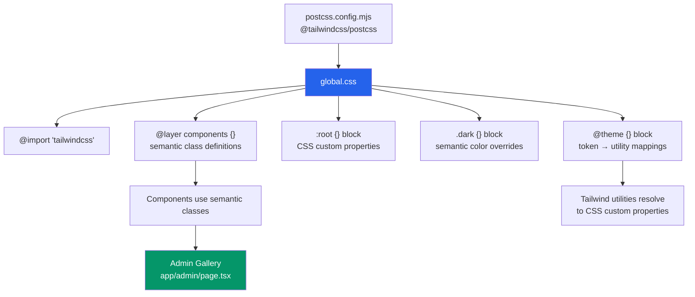
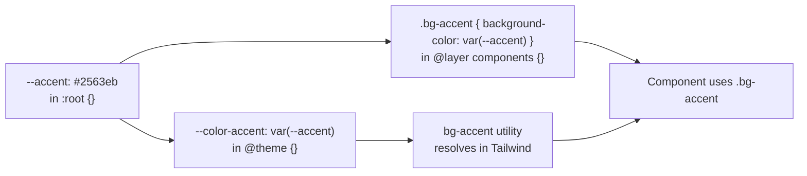

# Design Document: Design System Overhaul

## Overview

AMMY LMS currently has a split-personality styling architecture: `global.css` defines a hand-rolled CSS class system, but components reference Tailwind utility strings that resolve to nothing because Tailwind is not installed. Several component-scoped class names (`dashboard-card`, `card-body`) exist nowhere in the stylesheet, the button CVA setup double-applies variant and size classes, and the theme store hardcodes `'dark'` instead of reading the OS preference.

This overhaul replaces the entire styling architecture with **Tailwind v4's CSS-first approach**. `global.css` becomes the single source of truth: all design tokens live in `:root {}`, all Tailwind theme mappings live in `@theme {}`, and all semantic component classes live in `@layer components {}`. The admin gallery at `app/admin/page.tsx` is elevated to a permanent living design reference.

### Goals

- Zero broken class names anywhere in the codebase
- Every token simultaneously a CSS custom property and a Tailwind utility
- Semantic class names only — no component-scoped names
- System theme detection without hydration mismatch
- Admin gallery as the visual source of truth for the entire design system

### Non-Goals

- Replacing Radix UI primitives or shadcn component internals
- Changing the application's routing or data layer
- Adding new features beyond what the requirements specify

---

## Architecture

### Before: Split-Personality Architecture

```
global.css          ← hand-rolled CSS classes (no Tailwind)
components/*.tsx    ← mix of custom classes + broken Tailwind utilities
tailwind.config.ts  ← absent / not wired up
postcss.config.mjs  ← absent
```

Components reference classes like `bg-brand`, `text-text`, `border-border`, `rounded-xl` that either don't exist in `global.css` or are raw Tailwind utilities that never resolve because PostCSS isn't configured.

### After: CSS-First Single Source of Truth

```
postcss.config.mjs  ← registers @tailwindcss/postcss
global.css          ← @import "tailwindcss"
                       @theme { /* token → utility mappings */ }
                       :root { /* all CSS custom properties */ }
                       .dark { /* semantic color overrides */ }
                       @layer components { /* all semantic classes */ }
components/*.tsx    ← semantic classes only + layout Tailwind utilities
```



### Token Flow



---

## Components and Interfaces

### 1. `postcss.config.mjs` (new file)

Registers `@tailwindcss/postcss` as the PostCSS plugin. This is the only configuration file needed for Tailwind v4.

```mjs
export default {
  plugins: {
    '@tailwindcss/postcss': {},
  },
}
```

### 2. `app/ui/global.css` (full rewrite)

The single source of truth. Structured in this order:

| Section | Purpose |
|---|---|
| `@import "tailwindcss"` | Activates Tailwind v4 CSS-first mode |
| Google Fonts `@import` | Font loading |
| `@theme {}` | Maps CSS custom properties to Tailwind utility names |
| `:root {}` | All design tokens as CSS custom properties |
| `.dark {}` | Semantic color overrides for dark mode |
| Base reset | `*, body, html` resets |
| `@layer components {}` | All semantic class definitions |

**`@theme {}` block structure** — maps token names to their CSS variable references so Tailwind generates utility classes:

```css
@theme {
  --color-accent:          var(--accent);
  --color-bg-page:         var(--color-bg-page);
  --color-bg-surface:      var(--color-bg-surface);
  --color-bg-card:         var(--color-bg-card);
  --color-text-heading:    var(--color-text-heading);
  --color-text-body:       var(--color-text-body);
  --color-text-muted:      var(--color-text-muted);
  --font-display:          var(--font-display);
  --font-body:             var(--font-body);
  /* ... all tokens that need utility class access */
}
```

**`@layer components {}` class inventory** — every semantic class defined here, referencing only CSS custom properties:

- Typography: `.text-hero`, `.text-title`, `.text-heading`, `.text-subheading`, `.text-body`, `.text-caption`, `.text-fine`, `.text-label`
- Color modifiers: `.text-accent`, `.text-muted`, `.text-white`, `.color-muted`, `.color-accent`, `.color-white`, `.color-heading`
- Surfaces: `.surface-card`, `.surface-card-sm`, `.surface-sunken`, `.surface-interactive`
- Backgrounds: `.bg-page`, `.bg-surface`, `.bg-accent`, `.bg-subtle`, `.bg-white`, `.bg-gradient`, `.bg-glass`, `.bg-mesh`
- Borders: `.border-standard`, `.border-subtle`, `.border-strong`, `.border-accent`, `.border-top`
- Radius: `.radius-xs`, `.radius-sm`, `.radius-md`, `.radius-lg`, `.radius-xl`, `.radius-pill`
- Layout: `.page-wrapper`, `.page-container`, `.page-section`, `.section-header`, `.layout-shell`, `.layout-main`, `.layout-aside`, `.layout-content`, `.page-footer`
- Flex: `.row`, `.row-between`, `.row-end`, `.row-wrap`, `.col`, `.centered`, `.flex-center`
- Grid: `.grid-auto`, `.grid-halves`, `.grid-thirds`, `.grid-fourths`, `.grid-standard`
- Gap helpers: `.gap-inline`, `.gap-item`, `.gap-row`, `.gap-block`, `.gap-section`
- Stacks: `.stack-sm`, `.stack-md`, `.stack-lg`
- Buttons: `.btn-primary`, `.btn-secondary`, `.btn-outline`, `.btn-ghost`, `.btn-tertiary`, `.btn-tertiary-bordered`, `.btn-premium`, `.btn-destructive`, `.btn-sm`, `.btn-md`, `.btn-lg`, `.btn-icon`
- Navigation: `.nav-list`, `.nav-link`, `.nav-link.active`
- Forms: `.input-primary`
- Pills: `.pill`, `.pill-success`, `.pill-danger`, `.pill-alert`, `.pill-info`, `.pill-purple`
- Effects: `.effect-shimmer`, `.effect-glow`, `.effect-enlarge`, `.animate-fade-up`
- Overlays: `.overlay`, `.overlay.active`, `.pop-up`, `.toaster`, `.toaster.active`
- Structural: `.header-sticky`, `.brand-link`, `.logo-square`, `.dot-accent`
- Theme toggle: `.theme-toggle`, `.theme-toggle-thumb`, `.theme-toggle-track`, `.theme-toggle-sm/md/lg`
- Misc: `.w-full`, `.dim`, `.text-center`, `.relative`, `.absolute`, `.inset`, `.clip`, `.no-events`

### 3. `app/lib/store.ts` (targeted change)

Change the `theme` initial value from `'dark'` to `null`:

```ts
// Before
theme: 'dark',
toggleTheme: () => set((s) => ({ theme: s.theme === 'dark' ? 'light' : 'dark' })),

// After
theme: null as 'light' | 'dark' | null,
toggleTheme: () => set((s) => ({
  theme: s.theme === 'dark' ? 'light' : 'dark'
})),
setTheme: (t: 'light' | 'dark') => set({ theme: t }),
```

The `LMSState` type in `app/lib/utils/types/index.ts` must also be updated to reflect `theme: 'light' | 'dark' | null`.

### 4. `app/ui/components/system/Layout.tsx` (system theme detection)

Replace the current `useEffect` with one that handles the `null` case:

```tsx
useEffect(() => {
  const resolved = theme ?? (
    window.matchMedia('(prefers-color-scheme: dark)').matches ? 'dark' : 'light'
  )
  document.documentElement.classList.toggle('dark', resolved === 'dark')
}, [theme])
```

**Why this avoids hydration mismatch:** The server renders `<html>` with no theme class. The `useEffect` runs only on the client after hydration, so the server and client initial renders match. The CSS sets a default `background-color` on `html` matching the light-mode page background, preventing any flash.

### 5. `app/ui/components/atomic/button.tsx` (CVA fix)

The current `size.default` maps to `"btn-primary"`, which duplicates the variant class. Fix:

```ts
// Before (broken)
size: {
  default: "btn-primary",  // BUG: duplicates variant class
  sm: "btn-sm",
  lg: "btn-lg",
  icon: "btn-icon",
}

// After (correct)
size: {
  default: "btn-md",   // size maps to size class only
  sm: "btn-sm",
  lg: "btn-lg",
  icon: "btn-icon",
}
```

With `variant: { default: "btn-primary" }` and `size: { default: "btn-md" }`, rendering `<Button />` with no props produces `btn-primary btn-md` — no duplication.

### 6. `app/ui/components/molecule/DashboardCard.tsx` (class migration)

Remove component-scoped class names and replace with semantic equivalents:

```tsx
// Before
<div className="dashboard-card">
  <div className="card-body">
    <h3 className="card-title">{title}</h3>
    <p className="card-text">{description}</p>
  </div>
</div>

// After
<div className="surface-card col gap-item">
  <h3 className="text-subheading">{title}</h3>
  <p className="text-caption text-muted">{description}</p>
</div>
```

### 7. System components (class migration)

**`Dashboard.tsx`** — replace all broken Tailwind utilities:

| Before | After |
|---|---|
| `bg-page` (raw Tailwind) | `bg-page` (semantic class) |
| `bg-brand/10 text-brand` | `bg-accent text-white` or `pill-info` |
| `text-text` | `text-heading` or `text-body` |
| `border-border` | `border-standard` |
| `bg-surface` | `bg-surface` (now semantic) |
| `rounded-xl` | `radius-xl` |
| `text-brand` | `text-accent` |
| `bg-brand` | `bg-accent` |
| `text-emerald-500`, `text-amber-500` | `pill-success`, `pill-alert` |

**`Sidebar.tsx`** — same treatment:

| Before | After |
|---|---|
| `bg-surface border-r border-border` | `bg-surface border-standard` |
| `text-brand` | `text-accent` |
| `bg-brand/10` | `bg-accent` with opacity via `accent-light` |
| `text-text` | `text-body` |
| `bg-elevated` | `bg-surface` |
| `text-muted` | `text-muted` (now semantic) |

**`ContentPage.tsx`** — same treatment:

| Before | After |
|---|---|
| `bg-page` | `bg-page` (semantic) |
| `text-text` | `text-body` |
| `text-brand` | `text-accent` |
| `bg-surface rounded-xl border border-border` | `surface-card` |

### 8. `app/admin/page.tsx` (gallery rewrite)

Complete rewrite using only semantic classes. The inline `<style jsx global>` block at the bottom is removed — `flex-center` and `grid-standard` are now defined in `@layer components {}`.

**Gallery sections:**

1. **Header** — `row-between` layout, `text-title`, theme toggle using `.theme-toggle` component
2. **Typography** — `surface-card`, `col gap-block`, each type class with `.text-label` label
3. **Button System** — `grid-standard`, each variant in a `surface-card`, all 7 variants + 4 sizes
4. **Background Styles** — `grid-auto`, each bg class as a swatch with `flex-center`
5. **Borders & Radius** — `surface-card`, radius scale + border variants
6. **Status Tones** — `surface-card`, all 5 pill variants with icons
7. **Hover Effects** — `grid-thirds`, interactive cards with `effect-glow`, `effect-enlarge`, `effect-shimmer`
8. **Overlays & Messaging** — `surface-card`, toaster trigger + popup trigger buttons
9. **Form Inputs** — `surface-card`, `input-primary` in default/focused/placeholder states

---

## Data Models

### Theme State

```ts
type ThemeValue = 'light' | 'dark' | null

interface LMSState {
  // ... existing fields ...
  theme: ThemeValue          // null = use system preference
  toggleTheme: () => void    // cycles light ↔ dark (sets explicit value)
  setTheme: (t: 'light' | 'dark') => void  // explicit override
}
```

**State machine:**

```
null (system) ──toggleTheme──► 'dark' or 'light' (explicit)
'light' ──toggleTheme──► 'dark'
'dark'  ──toggleTheme──► 'light'
```

When `theme === null`, Layout reads `prefers-color-scheme`. Once the user toggles, the explicit value is persisted via Zustand `persist` middleware to `localStorage` under key `ammy-lms-v1`.

### Design Token Registry

All tokens follow this naming convention:

| Category | Pattern | Example |
|---|---|---|
| Brand | `--accent*` | `--accent`, `--accent-hover` |
| Semantic color | `--color-{role}-{variant}` | `--color-bg-card`, `--color-text-muted` |
| Type scale | `--size-{level}` | `--size-heading`, `--size-body` |
| Spacing | `--space-{n}` | `--space-4`, `--space-8` |
| Semantic spacing | `--pad-{intent}`, `--gap-{intent}` | `--pad-card`, `--gap-row` |
| Radius | `--radius-{step}` | `--radius-md`, `--radius-pill` |
| Shadow | `--shadow-{level}` | `--shadow-md`, `--shadow-accent` |
| Transition | `--transition-{speed}` | `--transition-fast` |
| Z-index | `--z-{layer}` | `--z-overlay`, `--z-toaster` |
| Tone | `--tone-{status}-{role}` | `--tone-success-bg`, `--tone-danger-text` |

### Raw Tailwind Allowed Utilities

The following Tailwind utility categories are permitted in component files without a semantic class equivalent:

```
Layout:     flex, grid, inline-flex, block, hidden
Alignment:  items-*, justify-*, self-*, place-*
Flex/Grid:  flex-1, flex-shrink-0, col-span-*, row-span-*, grid-cols-*
Spacing:    p-*, m-*, px-*, py-*, gap-* (numeric), space-*
Sizing:     w-*, h-*, min-*, max-*, size-*
Position:   relative, absolute, fixed, sticky, inset-*, top-*, left-*, right-*, bottom-*
Overflow:   overflow-*, truncate, whitespace-*
Z-index:    z-* (numeric)
Display:    hidden, block, inline, inline-block
Misc:       cursor-*, select-*, pointer-events-*, shrink-*, grow-*
```

**Forbidden in component files:**
- `bg-blue-*`, `bg-slate-*`, `text-gray-*` — raw palette colors
- `bg-[#hex]`, `text-[#hex]` — arbitrary color values
- `rounded-*` — use `.radius-*` semantic classes instead
- `border-*` (color) — use `.border-standard`, `.border-subtle` etc.
- `font-*` (family) — use `.text-*` semantic classes

---

## Correctness Properties

*A property is a characteristic or behavior that should hold true across all valid executions of a system — essentially, a formal statement about what the system should do. Properties serve as the bridge between human-readable specifications and machine-verifiable correctness guarantees.*

This feature is primarily a CSS architecture migration. Most acceptance criteria are configuration checks, file content checks, or UI rendering checks — categories where property-based testing adds limited value over static analysis. However, several requirements express universal invariants that hold across all tokens, all class names, and all component files. These are the testable properties.

**Property Reflection:** After reviewing all prework items, the following properties are distinct and non-redundant:
- P1 (token preservation) and P2 (no hardcoded values in component classes) are independent — one is about :root completeness, the other about class rule content
- P3 (no component-scoped names) and P4 (all used classes are defined) are complementary — P3 checks names in CSS, P4 checks names in TSX files
- P5 (no raw color utilities in components) and P4 overlap slightly but P5 is specifically about color utility patterns, P4 is about definition completeness
- P6 (dark mode token completeness) and P7 (dark mode token scope) are inverses of each other — P6 says required tokens ARE in .dark {}, P7 says non-semantic tokens are NOT in .dark {}
- P8 (cn() last-wins) is independent of all others

### Property 1: Token Preservation Round-Trip

*For any* token name that existed in the original `:root {}` block of `global.css`, the new `global.css` SHALL contain that same token name with the same value.

**Validates: Requirements 2.3**

### Property 2: Component Classes Reference Only CSS Custom Properties

*For any* component class rule defined in `@layer components {}`, every color, size, and spacing property value SHALL be a `var(--*)` reference, not a hardcoded hex color, pixel value, or palette name.

**Validates: Requirements 2.5, 5.3, 5.4**

### Property 3: No Component-Scoped Class Names in CSS

*For any* class name defined in `global.css`, that name SHALL NOT match the pattern of component-scoped identifiers (names that reference a specific UI component such as `dashboard-card`, `card-body`, `card-title`, `side-nav-item`, `surface-page`).

**Validates: Requirements 3.9, 8.9**

### Property 4: All Used Class Names Are Defined

*For any* class name referenced in a component `.tsx` file that is not a permitted raw Tailwind layout utility, that class name SHALL have a corresponding definition in `global.css`.

**Validates: Requirements 3.10, 8.8**

### Property 5: No Raw Color Utilities in Component Files

*For any* class name in a component `.tsx` file that matches the pattern `bg-{palette}-{shade}`, `text-{palette}-{shade}`, or `border-{palette}-{shade}` (e.g. `bg-blue-600`, `text-slate-500`), that class SHALL NOT appear — a semantic class from `global.css` SHALL be used instead.

**Validates: Requirements 5.2, 5.4**

### Property 6: Dark Mode Token Completeness

*For any* token in the required dark-mode override set (`--color-bg-page`, `--color-bg-surface`, `--color-bg-card`, `--color-bg-hover`, `--color-text-heading`, `--color-text-body`, `--color-text-muted`, `--color-border`, `--color-border-subtle`, `--color-border-strong`, and all five `--tone-*` pairs), that token SHALL appear in the `.dark {}` block of `global.css`.

**Validates: Requirements 9.1**

### Property 7: Dark Mode Override Scope

*For any* token that appears in the `.dark {}` block of `global.css`, that token SHALL be a semantic color token (matching `--color-*` or `--tone-*`) and SHALL NOT be a structural token (matching `--accent`, `--font-*`, `--size-*`, `--space-*`, `--radius-*`, `--shadow-*`, `--transition-*`, `--z-*`).

**Validates: Requirements 9.2**

### Property 8: cn() Last-Wins for Conflicting Semantic Classes

*For any* two conflicting semantic button class names (e.g. `btn-primary` and `btn-secondary`) passed to `cn()`, the result SHALL contain the last class provided and SHALL NOT contain the first class.

**Validates: Requirements 10.4**

---

## Error Handling

### Hydration Mismatch Prevention

The primary error risk in this overhaul is a React hydration mismatch caused by the theme class. The mitigation strategy:

1. **Server renders `<html>` with no theme class** — the `useEffect` in `Layout.tsx` only runs on the client, so the server HTML never includes `.dark` or `.light`
2. **CSS default background** — `html { background-color: var(--color-bg-page); }` is set in `global.css` with the light-mode value as the CSS custom property default, so the page background is correct before JavaScript runs
3. **Single `useEffect` pass** — the effect reads both the persisted store value and `window.matchMedia` in one pass, avoiding a second render cycle

### Missing Class Names

If a component references a class not defined in `global.css`, the element renders with no visual styling for that property — it fails silently. The mitigation:

- Property 4 (all used class names are defined) is enforced as a test
- The admin gallery serves as a visual smoke test — if a class is missing, the gallery section using it will look broken

### Tailwind v4 `@theme` Conflicts

If a token name in `@theme {}` conflicts with a Tailwind built-in utility name (e.g. `--color-red-500`), Tailwind v4 will override the built-in. Mitigation: all custom tokens use the `--color-bg-*`, `--color-text-*`, `--color-border-*` naming convention which does not conflict with Tailwind's palette namespace.

### `tailwind-merge` Stripping Semantic Classes

`tailwind-merge` may not recognize custom semantic classes and could strip them incorrectly. Mitigation: semantic classes like `btn-primary`, `surface-card` are not in Tailwind's utility namespace, so `tailwind-merge` treats them as unknown and preserves them. The last-wins behavior for conflicting semantic classes (Property 8) is verified by test.

### CVA Double-Apply

The existing bug where `size.default = "btn-primary"` causes `btn-primary` to appear twice in the class string. With `tailwind-merge` in `cn()`, duplicate class names are deduplicated, but the intent is still wrong (size should not set a variant class). The fix in `button.tsx` (`size.default = "btn-md"`) eliminates the root cause.

---

## Testing Strategy

This feature is a CSS architecture migration. The appropriate testing strategy is a combination of **static analysis tests** (parsing CSS and TSX files), **unit tests** (component rendering), and **visual smoke tests** (admin gallery).

Property-based testing is applicable for the universal invariants identified in the Correctness Properties section. The PBT library for this TypeScript/Next.js project is **fast-check**.

### Static Analysis Tests (Property-Based)

These tests parse the CSS and TSX source files and verify universal invariants. They run as part of the test suite using fast-check to generate inputs from the actual file content.

**P1 — Token Preservation:**
```ts
// Feature: design-system-overhaul, Property 1: Token preservation round-trip
// For each token in the original :root {} block, verify it exists in the new file
fc.assert(fc.property(
  fc.constantFrom(...originalTokenNames),
  (tokenName) => newCssContains(tokenName)
), { numRuns: originalTokenNames.length })
```

**P2 — No Hardcoded Values in Component Classes:**
```ts
// Feature: design-system-overhaul, Property 2: Component classes reference only CSS custom properties
// For each component class rule, verify all color/size values are var(--*) references
fc.assert(fc.property(
  fc.constantFrom(...componentClassRules),
  (rule) => allColorValuesAreVarReferences(rule)
), { numRuns: componentClassRules.length })
```

**P3 — No Component-Scoped Names:**
```ts
// Feature: design-system-overhaul, Property 3: No component-scoped class names in CSS
fc.assert(fc.property(
  fc.constantFrom(...allDefinedClassNames),
  (className) => !isComponentScopedName(className)
), { numRuns: allDefinedClassNames.length })
```

**P4 — All Used Classes Are Defined:**
```ts
// Feature: design-system-overhaul, Property 4: All used class names are defined
fc.assert(fc.property(
  fc.constantFrom(...allUsedClassNames),
  (className) => isAllowedLayoutUtility(className) || isDefinedInGlobalCss(className)
), { numRuns: allUsedClassNames.length })
```

**P5 — No Raw Color Utilities:**
```ts
// Feature: design-system-overhaul, Property 5: No raw color utilities in component files
fc.assert(fc.property(
  fc.constantFrom(...allComponentClassNames),
  (className) => !isRawColorUtility(className)
), { numRuns: allComponentClassNames.length })
```

**P6 — Dark Mode Token Completeness:**
```ts
// Feature: design-system-overhaul, Property 6: Dark mode token completeness
fc.assert(fc.property(
  fc.constantFrom(...requiredDarkModeTokens),
  (token) => darkBlockContains(token)
), { numRuns: requiredDarkModeTokens.length })
```

**P7 — Dark Mode Override Scope:**
```ts
// Feature: design-system-overhaul, Property 7: Dark mode override scope
fc.assert(fc.property(
  fc.constantFrom(...darkBlockTokens),
  (token) => isSemanticColorToken(token)
), { numRuns: darkBlockTokens.length })
```

**P8 — cn() Last-Wins:**
```ts
// Feature: design-system-overhaul, Property 8: cn() last-wins for conflicting semantic classes
const buttonVariantPairs = [
  ['btn-primary', 'btn-secondary'],
  ['btn-secondary', 'btn-outline'],
  ['btn-outline', 'btn-ghost'],
  ['btn-ghost', 'btn-premium'],
  ['btn-primary', 'btn-destructive'],
]
fc.assert(fc.property(
  fc.constantFrom(...buttonVariantPairs),
  ([first, second]) => {
    const result = cn(first, second)
    return result.includes(second) && !result.includes(first)
  }
), { numRuns: buttonVariantPairs.length })
```

### Unit Tests (Example-Based)

- **Button CVA fix**: Render `<Button />` with no props → className contains `btn-primary btn-md`, not `btn-primary btn-primary`
- **Button CVA fix**: Render `<Button size="sm" />` → className contains `btn-sm`, not `btn-primary btn-sm`
- **Theme store initialization**: `useLMSStore.getState().theme === null`
- **Theme store toggle**: `toggleTheme()` when `theme === null` → sets `'dark'` or `'light'` based on system preference mock
- **Layout theme detection**: When `theme === null` and `matchMedia` returns dark → `document.documentElement.classList.contains('dark') === true`
- **Layout theme detection**: When `theme === 'light'` → `document.documentElement.classList.contains('dark') === false`
- **DashboardCard**: Renders without `dashboard-card`, `card-body`, `card-title` in className
- **Admin gallery**: Renders without inline `<style>` blocks

### Visual Smoke Tests (Admin Gallery)

The admin gallery at `app/admin/page.tsx` is the primary visual verification surface:

1. Load the gallery in light mode → all sections render with correct colors
2. Toggle to dark mode → all sections update without page reload, no element retains light-mode colors
3. Verify all 8 typography classes are visible with labels
4. Verify all 7 button variants are visible and interactive
5. Verify all 4 button sizes are visible with labels
6. Verify all 7 background swatches are visible
7. Verify all 5 pill variants are visible
8. Verify hover effects work on the 3 effect cards
9. Trigger toaster → appears and auto-dismisses after 3 seconds
10. Open popup → renders with backdrop, closes on backdrop click
11. Verify `input-primary` renders in default, focused, and placeholder states

### Build Verification

After implementation, run `next build` and verify:
- No "unknown utility class" warnings
- No TypeScript errors
- No missing module errors for `@tailwindcss/postcss`
